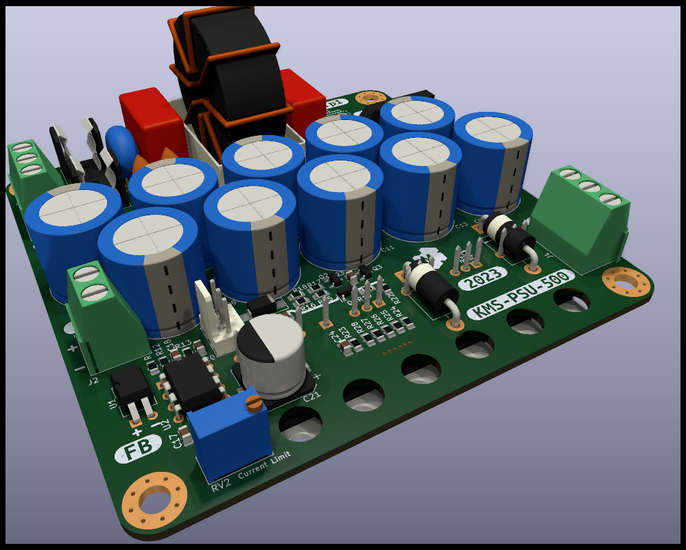
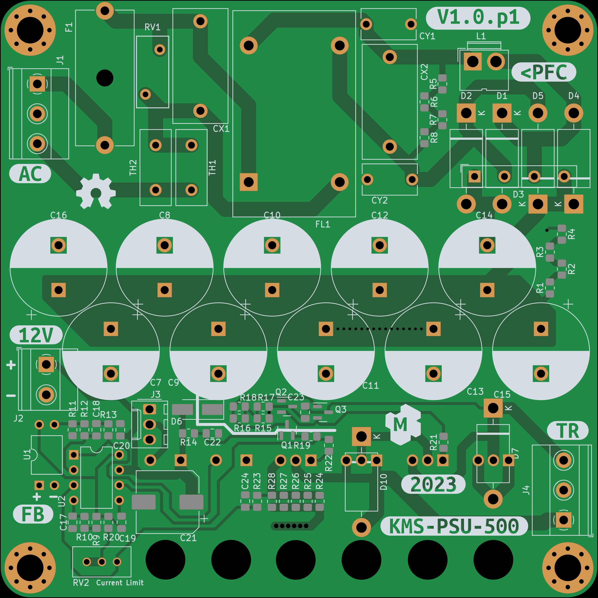
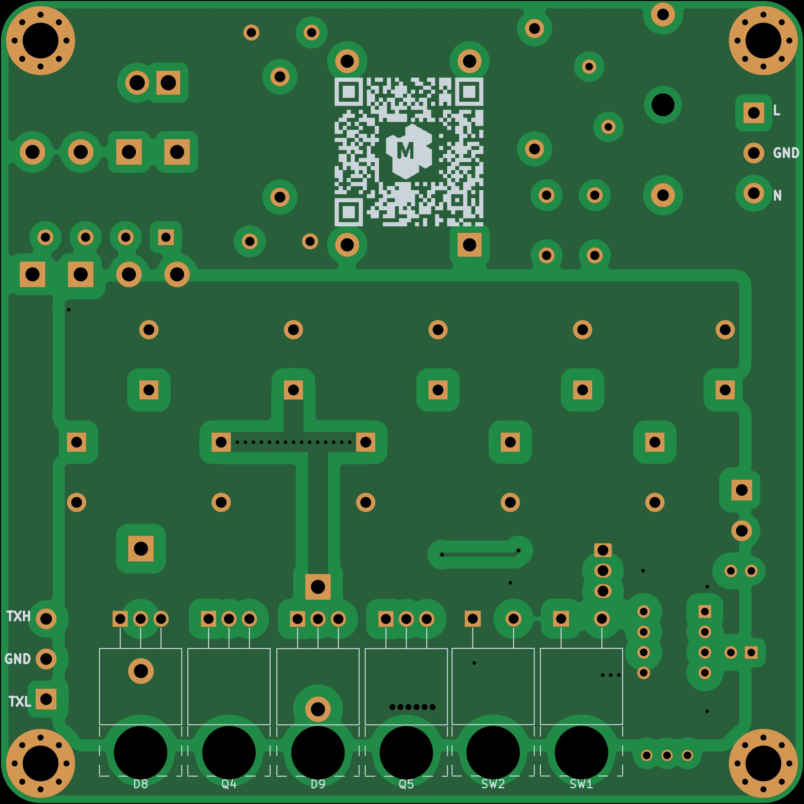
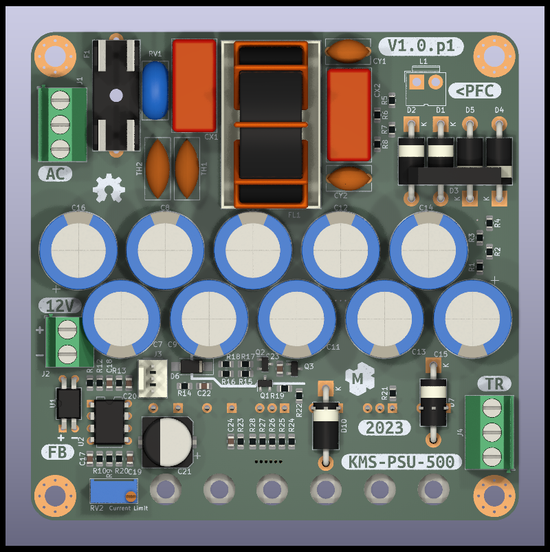

This is atempt to design a 500W PSU primary side 

Dev NOTE: before commit, run `./kibot.sh` to regenerate documentation, gerbers and other assets.

* [schematics.pdf](gen/schematics.pdf)
* [pcb.pdf with dimensions](gen/pcb.pdf)

